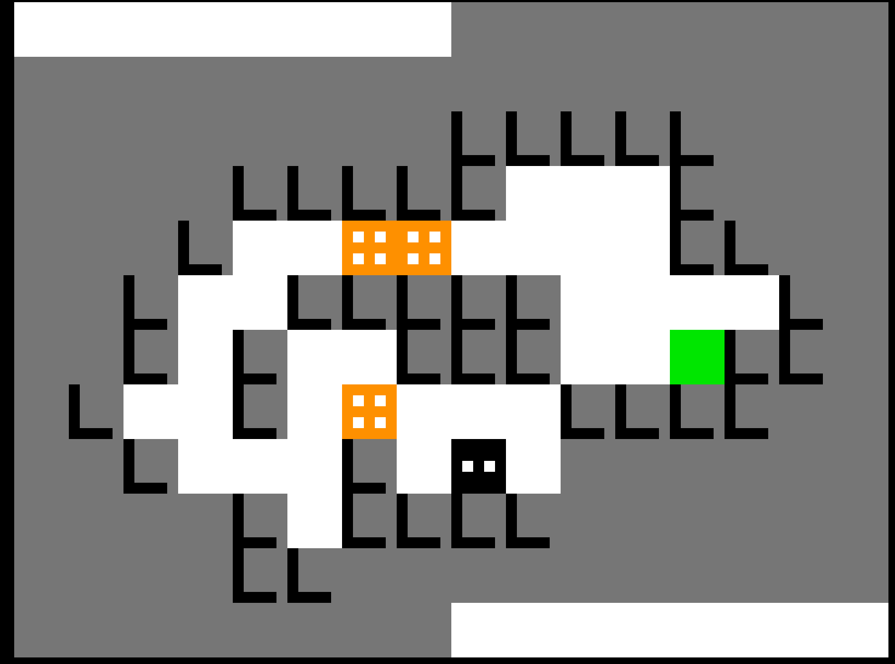

# Disclaimer before you continue

This is a Work in progress. the majority of example puzzles work (except rigid bodies, realtime games, sounds and some prelude fields)

But if this project is interesting to you, consider contributing! Making a new implementation of PuzzleScript is a huge undertaking. I look forward to making puzzles with you.

## Puzzles known to work

- EYE EYE EYE
- Match 3 Block Push
- Block Faker
- constellation z
- Kettle
- Lime Rick
- Match 3 Block Push
- Microban
- neko puzzle
- Notsnake
- Octat
- Zen Puzzle Garden
- Soliquid
- Watch Your Step
- Simple Block Crushing Game
- I Have No Mouth, And I Must  Create Blocks On All Sides Of Me
- Stairways
- Enqueue
- 🍡 -ooo- 🍡
- Path lines

## Contributing puzzle tests

If you have a puzzle you would like to add to the test suite you can add the puzzle to the `puzzles/` directory with the `.puzz` extension and add a test solution to the `runnerTest.c` test file. Look at `test_runs_stumper` for a simple example.

# Puzzle Engine

A C implementation of the PuzzleScript language and runtime

It has a number of renders you can use:

## 2d



## 3d


# Text Only


## Required libs

`check`, `flex`, `bison`, `gcc`, `sdl2`, `raylib`

## Mac build instructions

```bash
brew install check flex bison gcc
make
```

## Run tests

```bash
make check
```

# Acknowledgements

The language design is from increpare and everyone that contributed to puzzlescript and the puzzles

Original Puzzlescript implementation: https://github.com/increpare/PuzzleScript

Thanks for inspiring me with the line in the FAQ saying:

> it'd be too much fuss to keep a separate C implemention of PuzzleScript synchronised with the main one. But if you want to try to do so, knock yourself out : )

- https://www.puzzlescript.net/Documentation/faq.html

I use a number of puzzles to test my parsing and rule application work correctly, thanks to those puzzle creators I am happy to remove any puzzles you wish I didn't copy.
